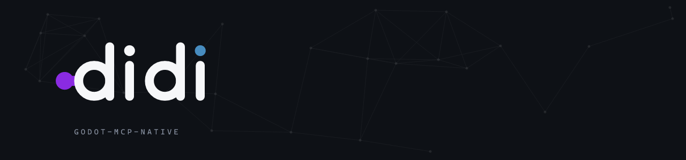

<picture>
  <source media="(prefers-color-scheme: dark)" srcset="docs/brand/png/readme-banner.png">
  <source media="(prefers-color-scheme: light)" srcset="docs/brand/png/readme-banner-light.png">
  
</picture>

# Didi (godot-mcp-native) 🎭

[](https://github.com/saworbit/didi/actions/workflows/ci.yml)
[](https://opensource.org/licenses/MIT)
[](https://godotengine.org/)
[](https://isocpp.org/)
[](https://modelcontextprotocol.io/)

> *"Nothing happens. Nobody comes, nobody goes. It's awful!"* — *Waiting for Godot*
> 
> *Didi keeps the bridge native, local, and explicit about what it can actually execute.*

**Didi** (`godot-mcp-native`) is a high-performance, native [Model Context Protocol (MCP)](https://modelcontextprotocol.io/) server for **Godot 4.5+**, engineered in **C++20** as a standalone executable (`didi.exe` on Windows, `didi` on POSIX) and an in-engine GDExtension library for the target platform.

The current documented release is **1.5.0**.

---

## 🧭 Navigating the Documentation

| Document | Target Audience | Description |
| :--- | :--- | :--- |
| 🚀 [**Quickstart Guide**](docs/QUICKSTART.md) | **Developers / Humans** | 5-minute step-by-step setup for Godot, Cursor, Claude, and VS Code. |
| 🤖 [**LLM Agent Instructions**](docs/LLM_INSTRUCTIONS.md) | **AI Assistants / LLMs** | Dedicated system prompt & decision tree for Claude, Cursor, Windsurf, Antigravity. |
| ✅ [**Current Capability Matrix**](docs/CAPABILITIES.md) | **Everyone** | Authoritative live, offline, unavailable, and unimplemented behavior. |
| 🗺️ [**Roadmap & 108-Tool Surface**](docs/ROADMAP.md) | **Developers / Contributors** | Completed phases and technical build order. |
| 🧪 [**Phase 7 API Feasibility Evidence**](docs/PHASE_7_API_FEASIBILITY.md) | **Developers / Governance** | Reproducible Godot 4.5.1/4.7.2 feasibility results and the exact three blocked contracts. |
| 📋 [**Phase 7 Approved Executable Plan**](docs/PHASE_7_IMPLEMENTATION_PLAN.md) | **Developers / Governance** | Approved atomic 83/83 plan, stopped at its feasibility gate. |
| 🛠️ [**Tool Reference Manual**](docs/TOOL_REFERENCE.md) | **Developers / LLMs** | Current behavior and limits for 108 canonical tools plus 10 legacy names. |
| 🏛️ [**Architecture & System Topology**](docs/ARCHITECTURE.md) | **Engineers / Architects** | Deep-dive into C++20 design, dual execution topology, threading safety, and named-pipe IPC. |
| 📦 [**Dynamic Resources & Prompts**](docs/RESOURCES_AND_PROMPTS.md) | **Developers / LLMs** | Technical specs for `godot://...` resources and prompt workflows. |
| 🛡️ [**Administrator & Operations Guide**](docs/ADMIN_GUIDE.md) | **DevOps / Admins** | Security DACL hardening, CI/CD headless execution, observability, and troubleshooting. |
| 👩‍💻 [**Developer & Extension Guide**](docs/DEVELOPER_GUIDE.md) | **Contributors** | How to build from source, write tests, and add custom MCP tools. |
| 📡 [**API & Wire Protocol Specification**](docs/API_SPECIFICATION.md) | **Integrators** | JSON-RPC 2.0 transport and binary frame specifications. |
| 🔐 [**Security Policy**](SECURITY.md) | **Users / Operators** | Supported release line, local attachment boundary, and private reporting guidance. |
| 📝 [**Changelog**](CHANGELOG.md) | **All** | Version history and notable changes. |
| 🤝 [**Contributing**](CONTRIBUTING.md) | **Contributors** | Build, test, and review expectations for a change you want merged. |
| 💚 [**Code of Conduct**](CODE_OF_CONDUCT.md) | **Everyone** | How people here are expected to treat each other, and how to report a problem. |
| 📦 [**Third Party Code**](THIRD_PARTY.md) | **Maintainers / Security** | The vendored sources no package manager resolves, their versions, and what Dependabot does not cover. |
| 🎨 [**Brand Identity**](docs/brand/BRAND.md) | **Contributors / Maintainers** | The mark, wordmark, lockups, palette, and the assets they generate from. |

---

## 🌟 Why Didi? (Design Rationale)

| Feature | Legacy Script/CLI Wrappers | Multi-Hop Network Bridges | **Didi (godot-mcp-native)** |
| :--- | :--- | :--- | :--- |
| **Execution Topology** | Offline CLI subprocesses | Node.js + WebSocket + C# Plugin | **Direct C++ GDExtension + Standalone Binary** |
| **In-Memory Scene Access** | ❌ Blind to live editor state | ⚠️ Depends on bridge | ✅ **Direct Godot objects for supported live tools** |
| **Undo / Redo Safety** | ❌ None (file overwrites) | ⚠️ Varies | ✅ **Native `EditorUndoRedoManager` transactions** |
| **Visual Inspection** | ❌ None | ⚠️ Often requires export | ✅ **Live editor PNG capture, node isolation, and exact pixel diffs** |
| **Transport** | Process startup per call | Network or multi-process bridge | **Local named pipe / Unix socket** |
| **External Dependencies**| Node.js / Python runtime | Node.js runtime + WebSockets | **Zero external runtime dependencies** |

---

## 🏗️ System Architecture

```
┌─────────────────────────────────────────────────────────────┐
│                    LLM Client (IDE / Agent)                 │
│               Cursor / Claude Desktop / VS Code             │
└──────────────────────────────┬──────────────────────────────┘
                               │  Standard MCP Protocol (stdio / JSON-RPC 2.0)
                               ▼
┌─────────────────────────────────────────────────────────────┐
│        Didi (C++ MCP Core Engine - didi / didi.exe)         │
│  - JSON-RPC 2.0 Dispatcher (MCP 2024-11-05 standard)       │
│  - Registry (108 canonical tools + 10 legacy names)          │
│  - Dynamic Resources (godot://project/tree, editor/state)   │
│  - IPC Session Manager (Named Pipes / Local IPC)            │
│  - Offline Fallback Engine (GDScript AST, .tscn parser)     │
└──────────────────────────────┬──────────────────────────────┘
                               │  Authenticated process-unique local IPC endpoint
                               ▼
┌─────────────────────────────────────────────────────────────┐
│        Godot 4.5+ Process (Didi extension library)          │
│  ┌───────────────────────┬───────────────────────────────┐  │
│  │ EditorInterface Hook  │ Editor ViewportTexture        │  │
│  │ (Main-thread Dispatch)│ (RGBA8 → PNG capture)         │  │
│  ├───────────────────────┼───────────────────────────────┤  │
│  │ Live SceneTree & Undo │ Extension IPC lifecycle       │  │
│  │ (EditorUndoRedoManager│ (timeouts and cancellation)   │  │
│  └───────────────────────┴───────────────────────────────┘  │
└─────────────────────────────────────────────────────────────┘
```

---

## 🛠️ Protocol Surface (107 Canonical Tools)

The 108 canonical names are the stable protocol surface, with 10 additional legacy registrations (118 total). The implementation remains 105/108 canonical tools, and all 3 Phase 7 names remain registered but unimplemented. Availability is explicit rather than implied: inspect `_meta.didi.executionModes`, `implemented`, `currentMode`, `liveAvailable`, `editorConnected`, and optional selected `sessionKind` from `tools/list`. `editorConnected` is true only for an editor route, while `liveAvailable` also requires that the selected editor/game kind is allowed for that exact definition. Phase 6 keeps the surface stable while requiring an explicit Godot project, adding project-keyed endpoints and one-client runtime locks, and exposing dry-run/confirmation controls on mutations. The coordination tools are the exception to the one-client picture: they are how separate agent processes share decisions and divide work, since each MCP client runs its own `didi` and nothing is shared in memory. Every definition also carries specification `annotations`: `readOnlyHint` is derived from the same classification that drives `dry_run`, so the read-only set is safe for a client to auto-approve, and successful JSON results carry `structuredContent` alongside the text block.

| Domain | Key Tools | Current execution |
| :--- | :--- | :--- |
| **1. Scene Tree & Nodes (7)** | `scene_get_hierarchy`, `scene_instantiate_node`, `scene_remove_node`, `scene_reparent_node`, `scene_set_property`, `scene_get_property`, `scene_duplicate_node` | Implemented live; hierarchy also has an offline `.tscn` fallback. Built-in nodes and scalar properties only. |
| **2. Signals & Events (4)** | `signal_list_connections`, `signal_connect`, `signal_disconnect`, `signal_emit` | Implemented live. Connect and disconnect register with the edited scene's UndoRedo history; emit requires confirmation. |
| **3. Scripting & Reflection (4)** | `script_check_syntax`, `script_reflect_class`, `script_get_symbols`, `script_patch_method` | Implemented offline/file-based; reflection covers every engine class from the pinned Godot API dump. |
| **4. Vision & Render (5)** | `viewport_capture_frame`, `viewport_diff_capture`, `viewport_set_camera_transform`, `viewport_create_test_lab`, `viewport_toggle_debug_draw` | Live capture returns a process-local ID; named-node isolation is reversible; exact-dimension RGBA diffs are live-only. Synthetic capture and test-lab generation remain offline. Camera transforms are editor-only UndoRedo mutations; collision/navigation debug hints affect future games run from that editor and return their prior state. |
| **5. Physics & Navigation (6)** | `physics_raycast_query`, `physics_simulate_step`, `nav_bake_mesh`, `nav_query_path`, `anim_list_tracks`, `anim_play_track` | Raycast and path queries run live against the root viewport's existing worlds in the editor or a game; animation listing reads an AnimationPlayer's library in either, and playback is a game-only transient call. Physics stepping and navigation baking remain unimplemented. |
| **6. Tilemaps & GridMaps (3)** | `tilemap_set_cells`, `tilemap_get_used_rect`, `gridmap_set_cells` | Editor-only live batch editing with whole-request preflight, one UndoRedo action, and read-only TileMapLayer used bounds. |
| **7. Resources & Files (9)** | `resource_create`, `resource_inspect`, `project_list_resources`, `project_get_uid_map`, `project_audit_assets`, `project_analyze_impact`, `project_search_text`, `project_search_symbols`, `asset_reimport` | File/resource inspection, bounded search, impact analysis, and conservative `.import` health diagnostics are offline; source-asset reimport is editor-only and waits for stable idle. |
| **8. Runtime & Debug (4)** | `runtime_launch`, `runtime_inject_input`, `runtime_get_call_stack`, `runtime_read_profiler` | Process launch is implemented offline; the profiler samples `Performance` monitors live over a bounded window; input injection dispatches explicit press and release events into a game session. Call stack remains unimplemented. |
| **9. Editor Lifecycle (4)** | `editor_undo`, `editor_redo`, `editor_save_scene`, `editor_reload_project` | Implemented live. Reload requests a resource-filesystem rescan. |
| **10. Project Wiring (18)** | Script attach/detach; autoload, InputMap, and setting management; groups; scene create/open/close/pack | Implemented live with UndoRedo, ProjectSettings persistence, typed events, overwrite guards, and normalized `res://` paths. |
| **11. Runtime Sessions (10)** | `runtime_list_sessions`, attach/detach/get, logs, pause/step/stop/tree, `eval_gdscript` | Four local session-management tools plus six live tools. Attachment is deterministic or explicit and always authenticated; evaluation is a strict read-only expression subset, not arbitrary GDScript. |
| **13. Agent Coordination (10)** | `blackboard_write`, `blackboard_read`, `blackboard_patch`, `blackboard_list_keys`, `blackboard_clear`, `blackboard_task_create`, `blackboard_task_claim`, `blackboard_task_update`, `blackboard_task_complete`, `blackboard_task_list` | Offline and file-backed under `.didi/blackboard/`, because each MCP client is its own process and shares no memory with the next. Every operation takes an exclusive OS lock for the whole read-modify-write, so a claim is atomic and two agents racing for one task produce a single winner. A lease expires, so an agent that dies strands nothing. Board content is data, never instruction. |
| **12. Deep Domains (6)** | `csharp_check_build`, `shader_check_compile`, `project_list_export_presets`, `project_export`, `gridmap_export_mesh_library`, `ui_hit_test` | Five bounded offline subprocess/file tools plus one editor-only transformed Control hit-test. Writes require project-contained normalized paths and explicit overwrite. |

### Phase 3 runtime contract

Didi publishes one private descriptor per loaded editor or game process. Windows uses `<OS temp>/didi-sessions`; POSIX uses `$XDG_RUNTIME_DIR/didi-sessions` when that value is absolute and otherwise falls back to `<OS temp>/didi-sessions-<euid>` (override only for controlled deployments with `DIDI_SESSION_DIR`; the operator owns override-directory access controls). POSIX defaults are owner-only; Windows grants the owning SID and local administrators. On first live availability, Didi auto-attaches only when the canonical project has one matching session, or one matching editor among games; same-kind ambiguity stays detached. Use `runtime_list_sessions` and `runtime_attach_session` to choose explicitly when needed. Public responses never include the 64-hex authentication token. Descriptor schema `1` / protocol `1.3` binds a 32-hex session ID to PID plus process start time so PID reuse is not treated as the same engine. Windows deletes an exactly verified retired descriptor through its open handle; POSIX deliberately retains the unpredictable non-`.json` tombstone after proof-safe retirement because it has no portable object-bound unlink, and discovery ignores that tombstone.

Live main-thread work has finite boundaries. At the extension's 15-second deadline, work that has not started returns `outcome: "not_started"` without quarantining the route; work that started but remains unresolved returns `outcome: "unknown_outcome"` and requests route quarantine. Public live tools and the runtime-log resource use a 17-second outer transport deadline and quarantine only the exact failed route generation, so callers must not blindly retry mutations with unknown outcomes.

`runtime_read_logs` polls the bounded 2,000-record Didi ring with a cursor. This structured ring records Didi lifecycle, command, control, and evaluation events; it does **not** intercept arbitrary `print()` output from Godot or another external process. Poll the separate bounded `runtime_read_output` stream for `print()`, warnings, errors, and script diagnostics from an attached editor or game. Use `runtime_launch` when you need bounded stdout/stderr from a Didi-owned child process captured after that process exits.

`eval_gdscript` accepts one expression (1–2048 UTF-8 bytes), an optional in-subtree `context_node`, and `timeout_ms` from 1–5000. It rejects statements, assignment, dynamic/indexed access, traversal, arbitrary dispatch, and mutation. Its timeout checks are cooperative, not preemptive; the grammar and receiver allowlist are deliberately small enough to bound accepted work. See the [Tool Reference](docs/TOOL_REFERENCE.md#11-phase-3-runtime-sessions) for the exact allowed calls and result limits.

### Phase 4 verification contract

`project_search_text` and `project_search_symbols` scan only allowlisted project text formats under strict file, byte, result, path, encoding, and preview bounds. `asset_reimport` accepts an all-or-nothing batch of normalized source assets and completes only after two consecutive editor-idle observations.

Every successful live viewport capture returns a 32-lowercase-hex `capture_id` backed by an 8-entry/64 MiB process-local raw RGBA cache; offline previews never receive IDs. `node_isolation_path` temporarily hides unrelated 2D/3D branches and restores every original value before success. `viewport_diff_capture` requires an unexpired live ID, exact dimensions, and a `0..255` threshold, returning metrics plus one transparent PNG diff without duplicating Base64 in the JSON metadata.

### Phase 5 deep-domain contract

Process-backed Phase 5 tools launch argv directly without a command shell, enforce per-request deadlines, cap combined output at 1 MiB, and terminate the child process group on timeout. Godot-backed checks require a discoverable Godot 4.5+ executable (or `GODOT_BIN`); C# checks require `dotnet`. Export and MeshLibrary outputs must be normalized project-contained `res://` paths and preserve existing files unless `overwrite: true`. Export-preset listing exposes only public preset identity and routing fields, never option values. `ui_hit_test` traverses at most 10,000 live nodes, applies visibility, clipping, transforms, canvas layer, z-order, draw order, and mouse-filter rules, returns at most 256 hits, and never injects input.

### Phase 6 enterprise-safety contract

Didi now refuses startup without `--project <root>` or `DIDI_PROJECT_ROOT`, and the selected directory must contain `project.godot`. Runtime endpoint names include a stable 16-hex project key while retaining process/session uniqueness. A per-session OS lock permits one MCP client at a time and is released automatically when that client exits. Every implemented mutation advertises `dry_run`; dry-runs return a handler-free structured change plan bound to the exact project and live route. `editor_reload_project`, script patching, and overwrite-enabled offline writers require the 64-hex, 120-second, single-use `confirmation_token` returned by the exact preview.

---

## Delivery Roadmap

<!-- phase7-current-status:start -->
**Status:** `PARTIAL_DELIVERY`
**Canonical implementation:** `105/108`
**Phase 7 registrations:** `3/18` unimplemented
**Feasibility:** `15/18` implementation-feasible; `3/18` API-blocked
<!-- phase7-current-status:end -->

Phases 1-6 established the implementation baseline. Phase 7 is `PARTIAL_DELIVERY`: the 2026-08-29 gate on Godot 4.5.1 and 4.7.2 found 15/18 names implementation-feasible and 3/18 API-blocked under the approved contracts. All 15 feasible names are now delivered; the implementation is 105/108 canonical tools and only the 3 API-blocked names remain registered but unimplemented.

Governance selected partial delivery: feasible tools ship only after their own production evidence, while `implemented: false` keeps unavailable names honest. The three API-blocked contracts remain `physics_simulate_step`, `nav_bake_mesh`, and `runtime_get_call_stack`.

Phase 8 is now `IN PROGRESS`. Its read-only slices provide bounded project audit, reverse impact analysis including exact static node paths, and conservative `.import` source/output health evidence. UID-cache reconciliation, checksum/importer-version validation, guarded import configuration, and broader incremental freshness remain planned.

See the [Roadmap](docs/ROADMAP.md), [Phase 7 feasibility evidence](docs/PHASE_7_API_FEASIBILITY.md), [approved executable plan](docs/PHASE_7_IMPLEMENTATION_PLAN.md), and [Future Phases Design](docs/FUTURE_PHASES_DESIGN.md).

---

## ⚡ 60-Second Setup for Humans

1. **Build Didi**:
   ```powershell
   cmake -B build -S .
   cmake --build build --config Release
   ```
2. **Enable Godot Plugin**:
   Copy `addons/didi` to your project and check **Enable** in **Project Settings $\rightarrow$ Plugins**.
3. **Connect AI Assistant**:
   Add to `claude_desktop_config.json` or `.cursor/mcp.json`:
   ```json
   {
     "mcpServers": {
       "didi": {
          "command": "D:/didi/build/Release/didi.exe",
          "args": ["--project", "D:/my_game"]
       }
     }
   }
   ```

---

## 🤖 Instructions for AI Assistants (LLMs)

Copy [**`docs/LLM_INSTRUCTIONS.md`**](docs/LLM_INSTRUCTIONS.md) into your agent instructions and keep [**`docs/CAPABILITIES.md`**](docs/CAPABILITIES.md) available as the current execution contract.

---

## 📄 License
MIT License. See [LICENSE](LICENSE) for details.
