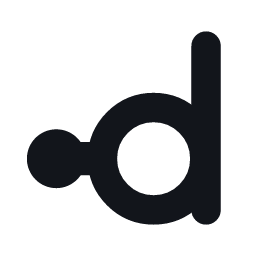

# Didi — brand identity

`godot-mcp-native` · a native C++20 MCP server for Godot 4.5+

---

## The mark

<p>
  <picture>
    <source media="(prefers-color-scheme: dark)" srcset="png/didi-mark-white-256.png">
    
  </picture>
</p>

A lowercase **d** whose bowl is entered from the left by a **node** and a **pipe**.

It carries three readings at once, and all three are literally true of Didi:

| Reading | What it means |
| :--- | :--- |
| **A lowercase `d`** | The product's own initial. The mark is the name, not an ornament bolted to it. |
| **node → pipe → ring** | The real topology: an MCP client, a local named pipe or Unix socket, and the live Godot scene it reaches into. Left to right is the request path. |
| **Two figures, unequal** | Didi and Gogo. [`GOGO_DESIGN.md`](../GOGO_DESIGN.md) puts it exactly: *Didi waits; Gogo is the one who actually shows up.* One tall standing form, one small one beside it. |

The ring is drawn open-centred and never filled: Didi *reaches into* a running scene, it does not
replace it. The ascender gives the mark a clear reading order and keeps the silhouette asymmetric,
so it never collapses into a symmetric blob at small sizes.

**Deliberately avoided:** robot heads (the Godot Engine mark is a trademark of the Godot
Foundation, and borrowing it would make Didi look like a fork of the engine rather than a bridge
to it); theatre masks (the obvious *Waiting for Godot* nod, and wrong — a mask connotes pretense,
while this server's stated value is being explicit about what it can actually execute, shipping
`implemented: false` rather than pretending); circuit boards, brains and globes (category clichés
that say "technology" and nothing about this technology).

## Weights

| Asset | Use |
| :--- | :--- |
| `svg/didi-mark.svg` | **Master.** Everything ≥ 20 px. Stroke 11.5 on a 100-unit grid. |
| `svg/didi-mark-compact.svg` | ≤ 20 px only — stroke 12, larger node. The extra mass survives favicon rasterisation. |
| `svg/didi-mark-gradient.svg` | Hero surfaces where the mark stands alone at size. |

Never use the compact weight above 20 px, and never scale the master below 16 px.

## Lockups

**`svg/didi-signature.svg` is the primary lockup.** The node feeds the wordmark's *own* first `d`.

This is not a stylistic preference. Because the mark is itself a lowercase `d`, placing it beside
the wordmark reads as **"d didi"** — a visible stutter. The signature dissolves it: mark and
wordmark become one continuous object.

| Asset | Use |
| :--- | :--- |
| `svg/didi-signature.svg` | One colour. Default for READMEs, docs, terminals, print. |
| `svg/didi-signature-brand.svg` | Violet node in, Godot-blue node out. Colour surfaces. |
| `svg/didi-lockup-stacked.svg` | Mark over wordmark. Square and narrow spaces. |
| `svg/didi-wordmark.svg` | Name alone, where the mark already appears nearby. |

**Do not** set the mark beside the wordmark with a gap. That is the stutter the signature exists
to fix.

## The wordmark

Custom-drawn on the mark's own grid — same 11.5 stroke, same 20-unit bowl radius. No font is
required or referenced; every letterform is outlined geometry, so the SVGs render identically
everywhere. Each `i` dot is a **node**, the same circle vocabulary as the mark.

## Colour

Both brand colours were already in this project's own README badges. The mark is the bridge
between exactly those two things, so the palette is inherited rather than invented.

| Token | Hex | Role |
| :--- | :--- | :--- |
| **MCP violet** | `#8A2BE2` | The entering node — the client side. |
| **Godot blue** | `#478cbf` | The far side — the live engine. |
| **Slate** | `#6A5ACD` | Single-colour brand use; the midpoint of the two. |
| **Ink** | `#12151B` | The mark on light backgrounds. |
| **Paper** | `#F6F7F9` | The mark on dark backgrounds. |
| **Ground** | `#0E1116` | Icon tile, banners, social preview. |

In the brand signature the violet node enters at the left and a Godot-blue node exits at the final
`i`. Two coloured dots carry the entire bridge idea while the letterforms stay neutral.

**Never** run a gradient across the wordmark — below roughly 200 px it flattens to a single hue and
fights legibility. The gradient belongs on the standalone mark only.

The mark must stay fully functional in one colour. Every source ships a `currentColor` variant.

## Clear space and minimum size

- **Clear space:** the node's diameter (23 grid units) on all four sides.
- **Minimum size:** mark 16 px; signature 96 px wide; stacked lockup 64 px wide.

## Files

```
docs/brand/svg/    13 sources, currentColor wherever one-colour use applies
docs/brand/png/    49 exports — the complete set, vendored so no toolchain is needed to use them
docs/brand/build.py, raster.js
```

The PNG set is committed in full (837 KB) rather than trimmed to what is referenced, so anyone
writing docs, a slide, or a release post can take an asset straight from the tree without
installing Python and Node first. `raster.js` reproduces it byte-for-byte from the SVG sources.

| File | Where it is used |
| :--- | :--- |
| `png/social-preview.png` | 1280 × 640. Repository **Settings → Social preview**. |
| `png/readme-banner.png`, `png/readme-banner-light.png` | 1280 × 300. Top of `README.md`, switched by `prefers-color-scheme`. |
| `png/favicon-16/32/48.png`, `svg/favicon.svg` | Documentation site. |
| `png/didi-icon-{16…1024}.png` | MCP client and IDE listings, where a tile is expected. |
| `png/didi-mark-{white,ink,gradient}-{16…1024}.png` | The bare mark in the three ink treatments, every standard size. |
| `png/didi-signature-*-1600.png`, `png/didi-stacked-*-900.png` | Raster lockups for slides, posts, and anywhere SVG is awkward. |

The banners and social preview are committed as **PNG** deliberately: their SVG sources set text in
a system font, and GitHub's SVG sanitiser does not render that reliably across platforms.

`svg/didi-mark.svg`, `svg/didi-mark-compact.svg` and `svg/didi-signature.svg` are
also **shipped inside the addon**, as `addons/didi/didi_mark.svg`,
`didi_mark_compact.svg` and `didi_signature.svg`. The Godot editor console reads
them as text and rasterises them at the editor's own scale, substituting the
theme's font colour for `currentColor` — which is why each of the three must keep
a `currentColor` variant, and why the compact cut earns its place: the main
screen tab icon is 16 px. The copies are byte-identical to these sources and
`tests/test_editor_console.py` fails the build if they drift, so the geometry
still lives in exactly one place.

## Regenerating

Geometry lives in exactly one place. Every asset — mark, wordmark, lockups, icons, banners —
derives from the constants at the top of `build.py`; nothing is hand-placed.

```bash
cd docs/brand
python build.py                  # SVG sources
npm install @resvg/resvg-js      # one-time; prebuilt binary, no system dependencies
node raster.js                   # PNG exports — regenerates exactly what is committed
```

Change `SW`, `R` or `CY` and the whole system re-derives consistently.

## If Gogo ever needs its own sub-mark

It should not get one while it remains a subsystem — `GOGO_DESIGN.md` is explicit that Didi
remains the product and Gogo lives under `didi::gogo`. If a sub-mark is ever warranted, derive it
from this system rather than inventing a second one: repeat the node into a short column of nodes
feeding the same ring, since Gogo is many benches behind one bridge.

## Licence

Original work for this repository. The mark deliberately shares no geometry with the Godot Engine
logo, which is a trademark of the Godot Foundation.
